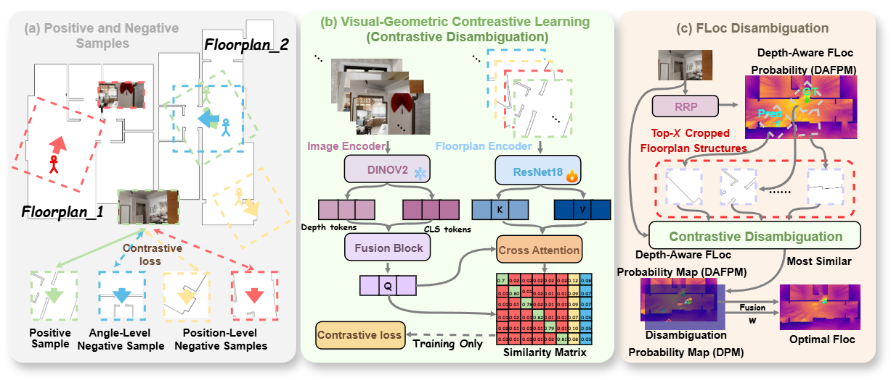

# DisCo-FLoc: Using Dual-Level Visual-Geometric Contrasts to Disambiguate Depth-Aware Visual Floorplan Localization

<div align="center">
  
</div>

This repository contains the implementation of DisCo-FLoc, a visual floorplan localization system that combines depth-aware geometric localization with visual-geometric DisCo reranking. The current codebase supports both Structured3D and Gibson training/evaluation in one branch.

## Environment

The code is tested with Python 3.8+ and PyTorch.

```bash
pip install -r requirements.txt
```

The image/depth backbone uses Depth Anything V2. Download the ViT-S checkpoint and place it at:

```text
checkpoints/depth_anything_v2_vits.pth
```

Download:

```text
https://huggingface.co/depth-anything/Depth-Anything-V2-Small/resolve/main/depth_anything_v2_vits.pth
```

## Data Layout

Datasets and checkpoints are not included in this repository.

Structured3D should be arranged as:

```text
datasets_s3d/
├── Structured3D/
│   ├── split.yaml
│   ├── scene_00000/
│   │   ├── imgs/
│   │   ├── map.png
│   │   ├── poses_map.txt
│   │   └── depth40.txt
│   └── ...
└── desdf/
    ├── scene_00000/
    │   └── desdf.npy
    └── ...
```

Gibson-F should be arranged as:

```text
datasets_gibson/
└── gibson_f/
    ├── split.yaml
    ├── <scene_name>/
    │   ├── imgs/
    │   ├── map.png
    │   ├── poses_map.txt
    │   ├── depth40.txt
    │   └── desdf.npy
    └── ...
```

Update the paths in `configs/paper/*.yaml` if your local data layout is different.

## Training

Train RRP on Structured3D:

```bash
python training/train_rrp_model.py --config configs/paper/rrp_s3d.yaml
```

Train DisCo on Structured3D:

```bash
python training/train_disco_model.py --config configs/paper/disco_s3d.yaml
```

Train RRP on Gibson-F:

```bash
python training/train_rrp_model.py --config configs/paper/rrp_gibson.yaml
```

Train DisCo on Gibson-F:

```bash
python training/train_disco_model.py --config configs/paper/disco_gibson.yaml
```

## Evaluation

Evaluate Structured3D with RRP + DisCo:

```bash
python eval/eval_disco_model_s3d.py \
  --rrp_model_ckpt checkpoints/RRP_s3d_best.ckpt \
  --disco_model_ckpt checkpoints/DisCo_s3d_best.ckpt
```

Evaluate Gibson-F with RRP + DisCo:

```bash
python eval/eval_disco_model_gibson.py \
  --rrp_model_ckpt checkpoints/RRP_gibson_f_best.ckpt \
  --disco_model_ckpt checkpoints/DisCo_gibson_f_best.ckpt
```

The Structured3D DisCo evaluator uses SE(2)-aware mode consolidation by default:

```text
mode_source_top_k = 1000
sigma_t = 0.6 m
sigma_theta = 30 deg
lambda_theta = 1.0
rho = 1.0
alpha = 0.5
```

GPU DESDF localization is enabled by default when CUDA is available. Pass `--cpu_localize` to use the CPU path.

## Useful Ablations

Hard-negative ablations:

```bash
python training/train_disco_model.py --config DisCo_FLoc_no_pos_neg.yaml
python training/train_disco_model.py --config DisCo_FLoc_no_ori_neg.yaml
python training/train_disco_model.py --config DisCo_FLoc_no_hard_neg.yaml
```

CLS-query DisCo variant:

```bash
python training/train_disco_model.py --config DisCo_FLoc_mixed_aug_cls_query_bs32.yaml
```

## Notes

- `checkpoints/`, `datasets_s3d/`, `datasets_gibson/`, `logs/`, and `wandb/` are intentionally ignored.
- The repository does not include pretrained model weights or dataset files.
- The `main` branch contains the unified Structured3D and Gibson code path; no separate Gibson branch is needed.
